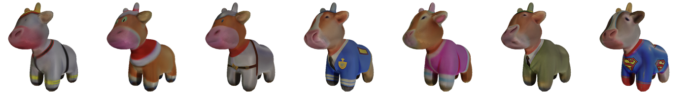

# *CasTex*: Cascaded Text-to-Texture Synthesis via Explicit Texture Maps and Physically-Based Shading
[](https://arxiv.org/abs/2504.06856)
[](https://thecrazymage.github.io/CasTex/)
[](LICENSE)

<div align="center">
  <h3><span style="color:green">🎉 Accepted to WACV 2026 🎉</span></h3>
</div>

<br>

This repository contains the official implementation of the WACV 2026 paper:
<br>
**CasTex: Cascaded Text-to-Texture Synthesis via Explicit Texture Maps and Physically-Based Shading** 
<br>
by [Mishan Aliev](https://scholar.google.com/citations?user=QJz42PEAAAAJ&hl=en), [Dmitry Baranchuk](https://scholar.google.com/citations?user=NiPmk8oAAAAJ&hl=en&oi=ao), [Kirill Struminsky](https://scholar.google.com/citations?hl=en&user=q69zIO0AAAAJ).


### Abstract

This work investigates text-to-texture synthesis using diffusion models to generate physically-based texture maps.
We aim to achieve realistic model appearances under varying lighting conditions.
A prominent solution for the task is score distillation sampling.
It allows recovering a complex texture using gradient guidance given a differentiable rasterization and shading pipeline.
However, in practice, the aforementioned solution in conjunction with the widespread latent diffusion models produces severe visual artifacts and requires additional regularization such as implicit texture parameterization.
As a more direct alternative, we propose an approach using cascaded diffusion models for texture synthesis (CasTex).
In our setup, score distillation sampling yields high-quality textures out-of-the box.
In particular, we were able to omit implicit texture parameterization in favor of an explicit parameterization to improve the procedure.
In the experiments, we show that our approach significantly outperforms state-of-the-art optimization-based solutions on public texture synthesis benchmarks.

For more details and results, please visit our [Project Page](https://thecrazymage.github.io/CasTex/).

If you are interested in collaborating or have any questions, please reach out to us via [alievmishan78@gmail.com](mailto:alievmishan78@gmail.com).



## Table of Contents
- [Installation](#installation)
- [Quick Start](#quick-start)
- [Benchmark on Objaverse subset](#benchmark-on-objaverse-subset)
- [Acknowledgements](#acknowledgements)
- [Citation](#citation)
- [License](#license)

## Installation

Please refer to [environment.yaml](environment.yaml) for the complete list of dependencies. To create and activate the environment using Miniconda3, run the following commands:

```.bash
git clone https://github.com/thecrazymage/CasTex.git
cd CasTex

module load Python CUDA/12.4 gnu10
conda env create -f environment.yaml -n castex
conda activate castex
pip install "git+https://github.com/facebookresearch/pytorch3d.git@V0.7.8" --no-build-isolation
```

## Quick Start

To generate a texture for a single object using a text prompt:
```.bash
bash scripts/run.sh
```
The generated PBR textures for stages `i` and `ii` will be saved in `logs/`.

## Benchmark on Objaverse subset

To generate textures for the Objaverse objects using the protocol from the [Text2Tex](https://arxiv.org/abs/2303.11396) paper, run the following command from the root directory:

1) Download Blender 3.3.21:
    ```.bash
    bash scripts/download_blender.sh
    ```
    This will download and extract **Blender** to `objaverse_eval/blender-3.3.21-linux-x64`.

2) To download and process the Objaverse subset:
    ```.bash
    bash scripts/objaverse_data_processing.sh
    ```
    This script downloads the original `.glb` models from the Objaverse dataset and converts them into clean `.obj` files ready for texturing.

    **Output locations:**
    - Original files: `objaverse_eval/objaverse_data/glbs`
    - Processed meshes: `objaverse_eval/objaverse_data/obj`

3) To generate the reference images for metric (FID/KID) calculation:
    ```.bash
    bash scripts/render_gt_frames.sh
    ```
    This script renders the original (ground truth) `.glb` files from the Objaverse subset using **Blender**.
    
    **Output:** All ground truth renders will be saved in `objaverse_eval/renders/ground_truth/frames`.

    *These renders are required to compute FID and KID scores.*

4) To generate textures for the preprocessed objects:
    ```.bash
    bash scripts/run_objaverse_eval.sh
    ```
    This script launches the generation process. It is optimized for multi-GPU setups (e.g., SLURM clusters).

    **Output:** Generated textures and logs will be saved in `logs/objaverse_eval_{date}`.

    > **Verification:** To ensure that the all generation process completed successfully, run the sanity check on the output folder:
    > ```
    > bash scripts/sanity_check.sh -d logs/objaverse_eval_{date} -ef 1 -ed 2 -esf 6
    > ```

5) To render the textured meshes to produce images for evaluation:
    ```.bash
    bash scripts/render_frames.sh logs/objaverse_eval_{date}/ ii eval_{date}
    ```

    This script renders the textures generated in stage `ii` from `logs/objaverse_eval_{date}/` using **Blender**.

    **Output:**
    - Rendered images will be stored in `objaverse_eval/renders/eval_{date}/frames`.
    - This step also produces 360° videos for qualitative comparison in `objaverse_eval/renders/eval_{date}/mp4`.

6) To calculate FID and KID:
    ```.bash
    scripts/run_metrics.sh objaverse_eval/renders/eval_{date}/frames/
    ```
    This script compares the generated renders from `objaverse_eval/renders/eval_{date}/frames/` against the ground truth from `objaverse_eval/renders/ground_truth/frames` and outputs the FID and KID scores.

    > **Note:** The computed metrics may slightly differ from the numbers reported in the paper due to variations in hardware and inherent randomness in the generation process. However, the overall trend and relative performance should remain consistent.

## Acknowledgements

We would like to thank the authors of the following open-source projects and tools:
-   [Text2Tex](https://github.com/daveredrum/Text2Tex) for the data utility scripts used in our evaluation pipeline.
-   [NVIDIA Kaolin](https://github.com/NVIDIAGameWorks/kaolin) for their 3D processing tools and rendering utilities.
-   [pytorch-fid](https://github.com/mseitzer/pytorch-fid) and [gan-metrics-pytorch](https://github.com/abdulfatir/gan-metrics-pytorch) for the implementations of evaluation metrics.
-   [Blender](https://www.blender.org/) for the amazing open-source 3D creation suite used for visualization.

Please refer to the **License** section for detailed licensing information regarding the code components.

We also thank [`Ksenia Ushatskaya`](https://t.me/scushaus) for visualizing the generated textures on the `assets/spot.obj` model used in the paper teaser. Special thanks go to [`Maxim Kodryan`](https://www.youtube.com/watch?v=pKejn72xpCo) — his mere existence was contribution enough.

## Citation

```bibtex
@article{aliev2025castex,
  title={CasTex: Cascaded Text-to-Texture Synthesis via Explicit Texture Maps and Physically-Based Shading},
  author={Aliev, Mishan and Baranchuk, Dmitry and Struminsky, Kirill},
  journal={arXiv preprint arXiv:2504.06856},
  year={2025}
}
```

## License

The original content of this repository is licensed under the [Apache License 2.0](./LICENSE).  
However, some parts of the code are adapted from third‑party projects and remain under their original licenses:

- **Text2Tex**: files in `objaverse_eval/objaverse_data_utils/` are based on [Text2Tex](https://github.com/daveredrum/Text2Tex) and are licensed under the **Creative Commons Attribution-NonCommercial-ShareAlike 3.0 Unported (CC BY-NC-SA 3.0)**. This implies that these parts are for non‑commercial use only and must be shared under the same license.
- **Kaolin**: parts of the code in `src/third_party/kaolin/` are adapted from [NVIDIA Kaolin](https://github.com/NVIDIAGameWorks/kaolin), which is licensed under **Apache 2.0** and the **NVIDIA Source Code License**.
- **Metrics**: files in `objaverse_eval/metrics/` are based on [pytorch-fid](https://github.com/mseitzer/pytorch-fid) and [gan-metrics-pytorch](https://github.com/abdulfatir/gan-metrics-pytorch), both licensed under **Apache 2.0**.

Please make sure to comply with these third‑party licenses, especially if you plan to use this code in commercial projects.